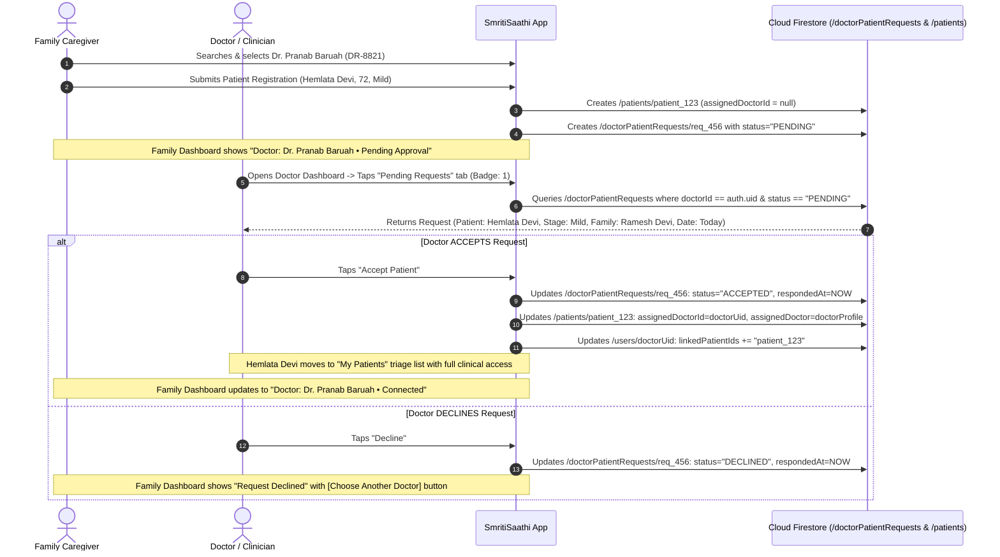

# Doctor Registration & Doctor–Patient Assignment System Architecture
**Project:** SmritiSaathi (স্মৃতিসাথী) — AI Dementia Companion  
**Document Type:** Comprehensive Audit, System Design & Implementation Plan  
**Status:** Planning Phase — Awaiting User Approval (Zero Code Implemented)

---

## A. Current Implementation & Architectural Audit

A comprehensive inspection of the entire codebase was conducted to evaluate existing authentication, registration, patient creation, and doctor assignment mechanisms.

### 1. Doctor Registration vs. Family Registration Status
- **Doctor Registration:**  
  - Currently, when a user selects `UserRole.DOCTOR` and signs in via Google or Instant Demo ([`AuthRepository.kt`](file:///c:/Users/Aanshumaan/Documents/HACKATHONS/SIH/DEMENTIA/android/app/src/main/java/com/socklet/smritisaathi/domain/repository/AuthRepository.kt#L100-L125)), the system assigns `role = UserRole.DOCTOR`, generates a `doctorCode` (`DOC-XXXX`), marks `profileCompleted = true`, and navigates directly to [`Screen.DoctorHome.route`](file:///c:/Users/Aanshumaan/Documents/HACKATHONS/SIH/DEMENTIA/android/app/src/main/java/com/socklet/smritisaathi/navigation/Screen.kt#L33).
  - **Doctor Registration does NOT require creating or adding a patient.** A doctor enters their dashboard directly.
  - **Missing in Doctor Registration:** Currently, if a doctor registers fresh, there is no empty-state card (*"No patients assigned yet"* or *"No pending requests"*), and the demo patient is automatically seeded in demo mode. We will formalize a clean empty state for production doctor accounts while retaining demo toggle capability.
- **Family Registration:**  
  - When a user signs in as `UserRole.FAMILY` ([`SmritiSaathiNavigation.kt`](file:///c:/Users/Aanshumaan/Documents/HACKATHONS/SIH/DEMENTIA/android/app/src/main/java/com/socklet/smritisaathi/navigation/SmritiSaathiNavigation.kt#L125-L135)), if `isNewUser == true` (no linked patients and `profileCompleted == false`), they are routed to [`Screen.FamilyAddPatient.route`](file:///c:/Users/Aanshumaan/Documents/HACKATHONS/SIH/DEMENTIA/android/app/src/main/java/com/socklet/smritisaathi/ui/family/onboarding/PatientOnboardingScreen.kt).
  - **Family registration strictly enforces the 8-step patient creation wizard** (Basic Details, Dementia Stage, Medical Reports, Family Contacts, Doctor Assignment, Daily Routine, Emergency Contact, Enhanced Support).

### 2. Patient Creation & Doctor Assignment Status
- **Patient Entity:** The [`Patient.kt`](file:///c:/Users/Aanshumaan/Documents/HACKATHONS/SIH/DEMENTIA/android/app/src/main/java/com/socklet/smritisaathi/domain/model/Patient.kt#L87-L111) model contains `assignedDoctorId: String?`, `assignedDoctor: Doctor?`, `assignedHospitalId: String?`, `assignedHospital: Hospital?`, and `createdBy: String`.
- **Onboarding Step 5 ([`DoctorHospitalScreen.kt`](file:///c:/Users/Aanshumaan/Documents/HACKATHONS/SIH/DEMENTIA/android/app/src/main/java/com/socklet/smritisaathi/ui/family/onboarding/DoctorHospitalScreen.kt)):** Currently queries a static local repository list of mock doctors (`Dr. Pranab Baruah`, `Dr. Ananya Sharma`) or allows adding a custom mock doctor. It **does not** query the real `/users` collection for registered doctors and **does not** create a pending assignment request.
- **Doctor Patient Queries ([`PatientRepository.kt`](file:///c:/Users/Aanshumaan/Documents/HACKATHONS/SIH/DEMENTIA/android/app/src/main/java/com/socklet/smritisaathi/domain/repository/PatientRepository.kt#L355-L370)):** Currently listens to `firestore.collection("patients").whereEqualTo("assignedDoctorId", doctorId)`.
- **Doctor Clinical Oversight UI ([`DoctorPatientDetailScreen.kt`](file:///c:/Users/Aanshumaan/Documents/HACKATHONS/SIH/DEMENTIA/android/app/src/main/java/com/socklet/smritisaathi/ui/doctor/DoctorPatientDetailScreen.kt)):** Queries real patient subcollections: `gameResults`, `reminders`, `behavioralAlerts`, and `clinicalNotes`.

---

## B. Existing Code & Architecture to Reuse

We will reuse and extend the existing codebase without creating duplicate or parallel subsystems:

1. **[`User.kt`](file:///c:/Users/Aanshumaan/Documents/HACKATHONS/SIH/DEMENTIA/android/app/src/main/java/com/socklet/smritisaathi/domain/model/User.kt):** Reuses `doctorCode`, `hospitalName`, `specialty`, `linkedPatientIds`, and `role`.
2. **[`Patient.kt`](file:///c:/Users/Aanshumaan/Documents/HACKATHONS/SIH/DEMENTIA/android/app/src/main/java/com/socklet/smritisaathi/domain/model/Patient.kt):** Reuses `assignedDoctorId`, `assignedDoctor: Doctor?`, and `createdBy`.
3. **[`AuthRepository.kt`](file:///c:/Users/Aanshumaan/Documents/HACKATHONS/SIH/DEMENTIA/android/app/src/main/java/com/socklet/smritisaathi/domain/repository/AuthRepository.kt):** Reuses Google Sign-In, demo account creation, and user profile management.
4. **[`PatientRepository.kt`](file:///c:/Users/Aanshumaan/Documents/HACKATHONS/SIH/DEMENTIA/android/app/src/main/java/com/socklet/smritisaathi/domain/repository/PatientRepository.kt):** Reuses patient CRUD, subcollection queries (`gameResults`, `reminders`, `behavioralAlerts`, `clinicalNotes`), and real-time `callbackFlow` listeners.
5. **[`DoctorNavGraph.kt`](file:///c:/Users/Aanshumaan/Documents/HACKATHONS/SIH/DEMENTIA/android/app/src/main/java/com/socklet/smritisaathi/ui/doctor/DoctorNavGraph.kt):** Reuses `DoctorMainScreen` and sub-navigation between patient triage and patient detail.
6. **[`DoctorDashboardScreen.kt`](file:///c:/Users/Aanshumaan/Documents/HACKATHONS/SIH/DEMENTIA/android/app/src/main/java/com/socklet/smritisaathi/ui/doctor/DoctorDashboardScreen.kt):** Reuses the header, Doctor Code share card, patient search bar, and patient status chips.
7. **[`DoctorPatientDetailScreen.kt`](file:///c:/Users/Aanshumaan/Documents/HACKATHONS/SIH/DEMENTIA/android/app/src/main/java/com/socklet/smritisaathi/ui/doctor/DoctorPatientDetailScreen.kt):** Reuses the cognitive performance graph, medication adherence overview, and clinical notes management dialog.
8. **[`firestore.rules`](file:///c:/Users/Aanshumaan/Documents/HACKATHONS/SIH/DEMENTIA/firestore.rules):** Reuses existing role-based access rules on `/patients/{patientId}` and subcollections.

---

## C. Proposed Registration Flows

```mermaid
graph TD
    subgraph DOCTOR_FLOW["Doctor Registration Flow (NO Patient Required)"]
        D1[Doctor Chooses 'Doctor' Role] --> D2[Google Sign-In / Demo]
        D2 --> D3[Check Profile in /users/doctorUid]
        D3 -->|New Account| D4[Generate Unique Permanent Doctor Code: DR-XXXX]
        D4 --> D5[Save Doctor Profile: role=DOCTOR, profileCompleted=true]
        D3 -->|Existing Account| D6[Retain Existing Doctor Code]
        D5 --> D7[Doctor Dashboard: Clinical Triage]
        D6 --> D7
        D7 --> D8[Empty State: 'No Patients Assigned Yet' & 'No Pending Requests']
    end

    subgraph FAMILY_FLOW["Family Registration Flow (COMPULSORY Patient Registration)"]
        F1[Family Chooses 'Family' Role] --> F2[Google Sign-In / Demo]
        F2 --> F3[Check Profile in /users/familyUid]
        F3 -->|New Account| F4[Launch 8-Step Patient Onboarding Wizard]
        F4 --> F5[Step 1-4: Basic Details, Stage, Reports, Contacts]
        F5 --> F6["Step 5: Doctor Search (Search by Code or Name)"]
        F6 --> F7[Select Doctor -> Review Doctor Profile]
        F7 --> F8[Step 6-8: Routine, Emergency, Enhanced Support]
        F8 --> F9[Submit Registration: Creates Patient & PENDING Request]
        F9 --> F10["Family Dashboard (Status: 'Pending Doctor Approval')"]
        F3 -->|Existing Account| F10
    end
```



### Key Differences:
1. **Doctor Registration:** Single-step auth $\rightarrow$ Profile setup with specialty & hospital $\rightarrow$ Direct dashboard entry with persistent `doctorCode`. No patient creation required.
2. **Family Registration:** Compulsory patient creation wizard $\rightarrow$ Optional/mandatory doctor search during onboarding $\rightarrow$ Creates a `PENDING` request upon submission.

---

## D. Persistent Doctor Code System

### 1. Code Format
- Format: `DR-XXXX` (or `DOC-XXXX`, e.g., `DR-8821` or `DR-4902`), alphanumeric 4-character uppercase suffix.
- Highly human-readable, verbalizable over phone, printable on clinic prescription slips.

### 2. Generation & Persistence Algorithm
```kotlin
// In AuthRepository.kt upon initial Doctor creation
fun generateUniqueDoctorCode(): String {
    val chars = "ABCDEFGHJKLMNPQRSTUVWXYZ23456789" // Excludes ambiguous 0, O, 1, I
    val randomSuffix = (1..4).map { chars.random() }.joinToString("")
    return "DR-$randomSuffix"
}
```
- **Idempotent / Permanent:** If `/users/{doctorUid}` already has a `doctorCode`, it is **never overwritten** upon subsequent logins.
- **Uniqueness Check:** Before saving a new code, a quick lookup ensures no other document in `/users` possesses the same `doctorCode`.

### 3. Display & Sharing
- Prominently shown in [`DoctorDashboardScreen.kt`](file:///c:/Users/Aanshumaan/Documents/HACKATHONS/SIH/DEMENTIA/android/app/src/main/java/com/socklet/smritisaathi/ui/doctor/DoctorDashboardScreen.kt) on a dedicated referral card with a 1-tap **Copy Code** and **Share** action.

---

## E. Real Firestore Doctor Directory & Search

Families will search for real registered Doctors stored in Cloud Firestore `/users` collection:

### Search Methods:
1. **By Exact Doctor Code:** Query `/users` where `role == "DOCTOR"` and `doctorCode == code.uppercase().trim()`.
2. **By Doctor Name:** Prefix query or case-insensitive search on `name` where `role == "DOCTOR"`.

### Doctor Search Result Item Card:
```text
┌────────────────────────────────────────────────────────┐
│ 👨‍⚕️ Dr. Pranab Baruah, MD                              │
│ Code: DR-8821 • Neurologist / Dementia Specialist      │
│ Hospital: GNRC Medical, Guwahati                       │
│                                           [ SELECT ]   │
└────────────────────────────────────────────────────────┘
```
- **Privacy Assurance:** Only professional, non-sensitive fields (`name`, `doctorCode`, `specialty`, `hospitalName`, `profilePhotoUrl`) are exposed. Personal phone numbers and private email addresses are never returned to unverified clients.

---

## F. Pending Request & Approval Workflow



---

## G. Recommended Firebase Data Model

### 1. `/users/{userId}` (Doctor or Family Profile)
```json
{
  "id": "doc_uid_123",
  "phoneNumber": "+919876543210",
  "role": "DOCTOR",
  "name": "Dr. Pranab Baruah",
  "email": "dr.baruah@gnrc.org",
  "doctorCode": "DR-8821",
  "specialty": "Neurologist & Dementia Specialist",
  "hospitalName": "GNRC Medical Institute, Guwahati",
  "linkedPatientIds": ["patient_123"],
  "profileCompleted": true,
  "createdAt": "2026-08-29T10:00:00Z",
  "lastLoginAt": "2026-08-29T14:30:00Z"
}
```

### 2. `/patients/{patientId}`
```json
{
  "id": "patient_123",
  "name": "Hemlata Devi",
  "age": 72,
  "gender": "FEMALE",
  "dementiaStage": "MILD",
  "preferredLanguage": "as",
  "pairingCode": "482910",
  "familyInviteCode": "FAM-9021",
  "createdBy": "family_uid_789",
  "assignedDoctorId": "doc_uid_123", // Null until ACCEPTED
  "assignedDoctor": {
    "id": "doc_uid_123",
    "name": "Dr. Pranab Baruah",
    "specialty": "Neurologist & Dementia Specialist",
    "hospitalName": "GNRC Medical Institute, Guwahati",
    "doctorCode": "DR-8821"
  },
  "createdAt": "2026-08-29T10:30:00Z",
  "updatedAt": "2026-08-29T10:35:00Z"
}
```

### 3. `/doctorPatientRequests/{requestId}` (Dedicated Requests Collection)
```json
{
  "id": "req_456",
  "patientId": "patient_123",
  "patientName": "Hemlata Devi",
  "patientAge": 72,
  "dementiaStage": "MILD",
  "familyId": "family_uid_789",
  "familyName": "Ramesh Devi",
  "familyRelationship": "Son",
  "doctorId": "doc_uid_123",
  "doctorName": "Dr. Pranab Baruah",
  "doctorCode": "DR-8821",
  "hospitalName": "GNRC Medical Institute, Guwahati",
  "status": "PENDING", // "PENDING" | "ACCEPTED" | "DECLINED" | "CANCELLED"
  "requestedAt": "2026-08-29T10:30:00Z",
  "respondedAt": null,
  "declineReason": null
}
```

---

## H. Security Rules & Permissions

The [`firestore.rules`](file:///c:/Users/Aanshumaan/Documents/HACKATHONS/SIH/DEMENTIA/firestore.rules) will enforce strict server-side boundary checks:

```javascript
rules_version = '2';
service cloud.firestore {
  match /databases/{database}/documents {

    // User Profiles:
    // - Users can write only their own profile
    // - Authenticated users can read doctor profiles to support Doctor Directory Search
    match /users/{userId} {
      allow read: if request.auth != null && (
        request.auth.uid == userId ||
        resource.data.role == "DOCTOR"
      );
      allow write: if request.auth != null && request.auth.uid == userId;
    }

    // Doctor-Patient Assignment Requests:
    // - Family can create a request for their patient
    // - Doctor can read and update (Accept/Decline) requests addressed to their doctorId
    // - Family can read requests they created
    match /doctorPatientRequests/{requestId} {
      allow create: if request.auth != null && request.resource.data.familyId == request.auth.uid;
      allow read: if request.auth != null && (
        resource.data.familyId == request.auth.uid ||
        resource.data.doctorId == request.auth.uid
      );
      allow update: if request.auth != null && (
        resource.data.doctorId == request.auth.uid || 
        resource.data.familyId == request.auth.uid
      );
      allow delete: if request.auth != null && resource.data.familyId == request.auth.uid;
    }

    // Patients Collection:
    // - Doctor gains read access ONLY if assignedDoctorId matches their auth.uid
    // - Unaccepted/Pending doctors have NO read/write access to /patients/{patientId}
    match /patients/{patientId} {
      allow read: if (request.auth != null && (
        resource.data.createdBy == request.auth.uid ||
        resource.data.assignedDoctorId == request.auth.uid ||
        resource.data.pairedDeviceId == request.auth.uid
      )) || (resource.data.pairingCode != null && resource.data.pairingCode != "");

      allow create: if request.auth != null;
      allow update: if request.auth != null && (
        resource.data.createdBy == request.auth.uid ||
        resource.data.assignedDoctorId == request.auth.uid ||
        resource.data.pairedDeviceId == request.auth.uid
      );
      allow delete: if request.auth != null && resource.data.createdBy == request.auth.uid;

      // Subcollections (gameResults, reminders, clinicalNotes, alerts):
      // Only accessible if parent patient has assignedDoctorId == auth.uid
      match /{subcollection=**} {
        allow read, write: if request.auth != null && (
          get(/databases/$(database)/documents/patients/$(patientId)).data.createdBy == request.auth.uid ||
          get(/databases/$(database)/documents/patients/$(patientId)).data.assignedDoctorId == request.auth.uid ||
          get(/databases/$(database)/documents/patients/$(patientId)).data.pairedDeviceId == request.auth.uid
        );
      }
    }
  }
}
```

---

## I. Doctor Dashboard Navigation Enhancement

In [`DoctorNavGraph.kt`](file:///c:/Users/Aanshumaan/Documents/HACKATHONS/SIH/DEMENTIA/android/app/src/main/java/com/socklet/smritisaathi/ui/doctor/DoctorNavGraph.kt):
We will add a tab navigation bar or header switch on the Doctor Dashboard:
- **Tab 1: My Patients** (Assigned & Accepted Patients triage list + Search).
- **Tab 2: Pending Requests** (Pending requests with Patient Summary, Family Name, Date, Accept and Decline buttons).
- **Tab 3: Doctor Profile** (Referral Code, Hospital, Specialty, Sign Out).

---

## J. Exact Files to Modify / Create

| File | Type | Changes Planned |
|---|---|---|
| [`domain/model/DoctorPatientRequest.kt`](file:///c:/Users/Aanshumaan/Documents/HACKATHONS/SIH/DEMENTIA/android/app/src/main/java/com/socklet/smritisaathi/domain/model/DoctorPatientRequest.kt) | **[NEW]** | Data class for pending/accepted/declined assignment requests. |
| [`domain/repository/AuthRepository.kt`](file:///c:/Users/Aanshumaan/Documents/HACKATHONS/SIH/DEMENTIA/android/app/src/main/java/com/socklet/smritisaathi/domain/repository/AuthRepository.kt) | **[MODIFY]** | Add `searchDoctors(query: String): Result<List<User>>` and `getDoctorByCode(code: String): Result<User?>`. |
| [`domain/repository/PatientRepository.kt`](file:///c:/Users/Aanshumaan/Documents/HACKATHONS/SIH/DEMENTIA/android/app/src/main/java/com/socklet/smritisaathi/domain/repository/PatientRepository.kt) | **[MODIFY]** | Add `sendDoctorRequest()`, `getPendingRequestsForDoctor()`, `acceptDoctorRequest()`, `declineDoctorRequest()`, `getDoctorRequestForPatient()`. |
| [`ui/family/onboarding/DoctorHospitalScreen.kt`](file:///c:/Users/Aanshumaan/Documents/HACKATHONS/SIH/DEMENTIA/android/app/src/main/java/com/socklet/smritisaathi/ui/family/onboarding/DoctorHospitalScreen.kt) | **[MODIFY]** | Replace mocked doctors with live Firestore search (by name or `DR-XXXX` code), showing doctor cards with `[Select]` button. |
| [`ui/family/onboarding/PatientOnboardingViewModel.kt`](file:///c:/Users/Aanshumaan/Documents/HACKATHONS/SIH/DEMENTIA/android/app/src/main/java/com/socklet/smritisaathi/ui/family/onboarding/PatientOnboardingViewModel.kt) | **[MODIFY]** | Integrate real doctor search query and dispatch pending request upon onboarding submission. |
| [`ui/family/FamilyDashboardScreen.kt`](file:///c:/Users/Aanshumaan/Documents/HACKATHONS/SIH/DEMENTIA/android/app/src/main/java/com/socklet/smritisaathi/ui/family/FamilyDashboardScreen.kt) | **[MODIFY]** | Add **"Assigned Doctor & Clinical Status"** card (showing *Pending Approval*, *Connected*, or *Declined — Choose Another Doctor*). |
| [`ui/doctor/DoctorNavGraph.kt`](file:///c:/Users/Aanshumaan/Documents/HACKATHONS/SIH/DEMENTIA/android/app/src/main/java/com/socklet/smritisaathi/ui/doctor/DoctorNavGraph.kt) | **[MODIFY]** | Add sub-routes for *My Patients* and *Pending Requests*. |
| [`ui/doctor/DoctorDashboardScreen.kt`](file:///c:/Users/Aanshumaan/Documents/HACKATHONS/SIH/DEMENTIA/android/app/src/main/java/com/socklet/smritisaathi/ui/doctor/DoctorDashboardScreen.kt) | **[MODIFY]** | Add empty states for 0 patients, integrate *Pending Requests* tab with Accept/Decline action handlers. |
| [`firestore.rules`](file:///c:/Users/Aanshumaan/Documents/HACKATHONS/SIH/DEMENTIA/firestore.rules) | **[MODIFY]** | Add security rules for `/doctorPatientRequests` and doctor search on `/users`. |

---

## K. Safe Implementation Sequence

1. **Step 1: Domain Models & Repository Contracts**
   - Create `DoctorPatientRequest.kt` model.
   - Implement `searchDoctors`, `getDoctorByCode`, `sendDoctorRequest`, `acceptDoctorRequest`, `declineDoctorRequest` in `AuthRepository.kt` and `PatientRepository.kt`.
2. **Step 2: Firestore Security Rules**
   - Update `firestore.rules` for request collections and doctor visibility.
3. **Step 3: Family Onboarding & Live Doctor Search**
   - Update `DoctorHospitalScreen.kt` and `PatientOnboardingViewModel.kt` to search live doctors in Firestore by name or code.
4. **Step 4: Family Dashboard Doctor Status Card**
   - Add status card on `FamilyDashboardScreen.kt` (*Pending*, *Connected*, *Declined*).
5. **Step 5: Doctor Dashboard Pending Requests Tab & Empty States**
   - Implement Pending Requests view with Accept/Decline in `DoctorDashboardScreen.kt`.
   - Implement empty state views for Doctors with 0 patients.
6. **Step 6: Build Verification & Multi-Role Testing**
   - Run `./gradlew assembleDebug` and execute end-to-end verification.

---

## L. Testing Plan

| Test Case | Step-by-Step Verification | Expected Result |
|---|---|---|
| **1. Fresh Doctor Registration** | Log in with a new Google Account as Doctor $\rightarrow$ Do not add any patient. | Doctor profile created in `/users`, permanent `DR-XXXX` code assigned, lands on Doctor Dashboard with empty state (*"No Patients Assigned"*). |
| **2. Fresh Family Registration** | Log in with a new Google Account as Family. | Forced into 8-step Patient Onboarding wizard. Cannot skip patient creation. |
| **3. Live Doctor Search by Code** | In Step 5 of Onboarding, type exact doctor code `DR-8821`. | Live doctor card (*Dr. Pranab Baruah*) is fetched from Firestore and displayed. |
| **4. Live Doctor Search by Name** | In Step 5 of Onboarding, type `"Pranab"`. | Matching registered doctors appear in search results. |
| **5. Pending Request Dispatch** | Complete patient registration with selected Doctor. | Patient record created with `assignedDoctorId = null`, pending request document created in `/doctorPatientRequests`. Family dashboard shows *"Pending Doctor Approval"*. |
| **6. Doctor Request Review** | Log in as Doctor `DR-8821` $\rightarrow$ Open *Pending Requests*. | Hemlata Devi's request appears with age, stage, and family contact details. |
| **7. Doctor Accepts Request** | Doctor taps *"Accept"*. | Request marked `ACCEPTED`, patient's `assignedDoctorId` updated to doctor's UID. Hemlata Devi appears in Doctor's triage list. |
| **8. Real Data Accessibility** | Doctor opens Hemlata Devi in Doctor Dashboard. | Real cognitive scores, medication adherence, and clinical notes load successfully. |
| **9. Doctor Declines Request** | Test another request $\rightarrow$ Doctor taps *"Decline"*. | Request marked `DECLINED`. Family dashboard updates to *"Request Declined — Choose Another Doctor"*. Doctor gains zero access to patient data. |
| **10. Security Boundary Verification** | Unassigned Doctor attempts to query patient document. | Firestore security rules reject read request with `PERMISSION_DENIED`. |
