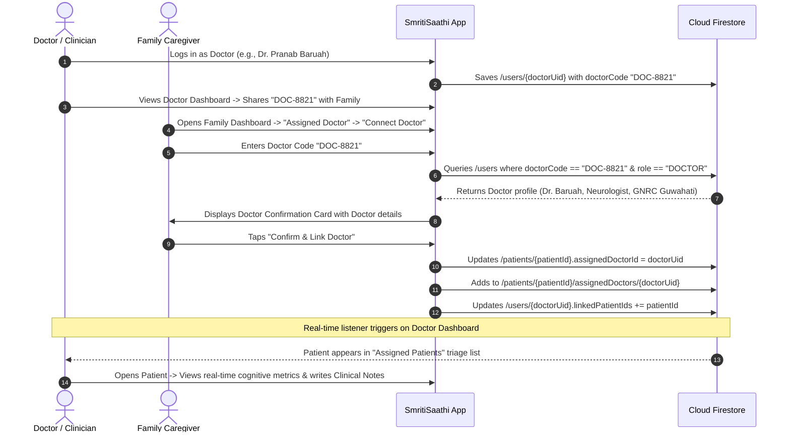

# Doctor–Patient Assignment Architecture & Implementation Plan
**Project:** SmritiSaathi (স্মৃতিসাথী) — AI Dementia Companion  
**Document Version:** 1.0.0  
**Status:** Investigation & Design Plan (Pending User Approval)

---

## 1. Current Situation & Audit Findings

Based on a thorough inspection of the active codebase, here is the current state of Doctor–Patient relationships:

| Component | Current Implementation Status | Source Files |
|---|---|---|
| **Doctor Referral Code Generation** | **Implemented:** When a Doctor signs up or logs in via Google/Demo, `AuthRepository` generates a unique `doctorCode` (`DOC-XXXX`) and saves it to `/users/{doctorUid}`. It is displayed on the Doctor Dashboard header card (*"Your Doctor Referral Code: DOC-8821 — Share with Families"*). | [`User.kt`](file:///c:/Users/Aanshumaan/Documents/HACKATHONS/SIH/DEMENTIA/android/app/src/main/java/com/socklet/smritisaathi/domain/model/User.kt), [`AuthRepository.kt`](file:///c:/Users/Aanshumaan/Documents/HACKATHONS/SIH/DEMENTIA/android/app/src/main/java/com/socklet/smritisaathi/domain/repository/AuthRepository.kt), [`DoctorDashboardScreen.kt`](file:///c:/Users/Aanshumaan/Documents/HACKATHONS/SIH/DEMENTIA/android/app/src/main/java/com/socklet/smritisaathi/ui/doctor/DoctorDashboardScreen.kt) |
| **Patient Data Model** | **Implemented:** The `Patient` entity includes `assignedDoctorId: String?`, `assignedDoctor: Doctor?`, `assignedHospitalId: String?`, and `assignedHospital: Hospital?`. | [`Patient.kt`](file:///c:/Users/Aanshumaan/Documents/HACKATHONS/SIH/DEMENTIA/android/app/src/main/java/com/socklet/smritisaathi/domain/model/Patient.kt) |
| **Doctor Patient Query** | **Implemented:** `PatientRepository.getPatientsByDoctorId(doctorId)` listens via snapshot listener to `/patients` where `assignedDoctorId == doctorId`. | [`PatientRepository.kt`](file:///c:/Users/Aanshumaan/Documents/HACKATHONS/SIH/DEMENTIA/android/app/src/main/java/com/socklet/smritisaathi/domain/repository/PatientRepository.kt#L355-L371) |
| **Firestore Security Rules** | **Implemented & Ready:** `firestore.rules` already explicitly allows read/write access to patient root and all subcollections if `resource.data.assignedDoctorId == request.auth.uid`. | [`firestore.rules`](file:///c:/Users/Aanshumaan/Documents/HACKATHONS/SIH/DEMENTIA/firestore.rules#L18-L43) |
| **Doctor Referral Code Lookup** | **MISSING:** There is no query function in `AuthRepository` or `PatientRepository` to resolve a `doctorCode` (e.g., `"DOC-8821"`) to a Doctor's user profile (`User`). | *To be added* |
| **Family Onboarding Assignment** | **INCOMPLETE:** Step 5 of Patient Onboarding (`DoctorHospitalScreen.kt`) currently lists mocked doctor names instead of validating a real Doctor Referral Code. | [`DoctorHospitalScreen.kt`](file:///c:/Users/Aanshumaan/Documents/HACKATHONS/SIH/DEMENTIA/android/app/src/main/java/com/socklet/smritisaathi/ui/family/onboarding/DoctorHospitalScreen.kt) |
| **Family Dashboard Assignment Hub** | **MISSING:** Once a patient is registered, the Family Dashboard displays Device Pairing and Family Invite codes, but lacks an "Assigned Doctor / Connect Doctor" management card. | [`FamilyDashboardScreen.kt`](file:///c:/Users/Aanshumaan/Documents/HACKATHONS/SIH/DEMENTIA/android/app/src/main/java/com/socklet/smritisaathi/ui/family/FamilyDashboardScreen.kt) |

---

## 2. Existing Components to Reuse

The project already possesses the ideal foundation. We do **not** need to build a new architecture from scratch; we only need to connect the existing pieces:

1. **`User.doctorCode` & Doctor Referral Card:** Reuses the generated 4-digit referral code format (`DOC-XXXX`) in [`User.kt`](file:///c:/Users/Aanshumaan/Documents/HACKATHONS/SIH/DEMENTIA/android/app/src/main/java/com/socklet/smritisaathi/domain/model/User.kt#L22).
2. **`Patient.assignedDoctorId` & `Patient.assignedDoctor`:** Directly updates these fields on `/patients/{patientId}` in [`Patient.kt`](file:///c:/Users/Aanshumaan/Documents/HACKATHONS/SIH/DEMENTIA/android/app/src/main/java/com/socklet/smritisaathi/domain/model/Patient.kt#L98-L99).
3. **`PatientRepository.assignDoctorToPatient`:** Existing helper method in [`PatientRepository.kt`](file:///c:/Users/Aanshumaan/Documents/HACKATHONS/SIH/DEMENTIA/android/app/src/main/java/com/socklet/smritisaathi/domain/repository/PatientRepository.kt#L155-L184).
4. **`PatientRepository.getPatientsByDoctorId`:** Real-time Flow used by [`DoctorDashboardScreen.kt`](file:///c:/Users/Aanshumaan/Documents/HACKATHONS/SIH/DEMENTIA/android/app/src/main/java/com/socklet/smritisaathi/ui/doctor/DoctorDashboardScreen.kt#L36).
5. **Existing `firestore.rules`:** Already matches `assignedDoctorId == request.auth.uid`.

---

## 3. Recommended User Flow



### Why "Direct Code Confirmation" is Best (vs. Two-Way Request/Approval):
1. **Simplicity for Hackathons & Rural Indian Context:** In Assam/rural clinics, doctors give patients a slip/code during OPD consultation. When the family enters the code and confirms the doctor's name and clinic, linking takes effect immediately without requiring asynchronous push notification approval steps that could fail on low-connectivity networks.
2. **Instant Feedback:** Family sees doctor credentials (name, specialization, hospital) before confirming.
3. **Revocability:** Family can unlink or change the assigned doctor anytime from the Family Dashboard.

---

## 4. Recommended Firebase Data Architecture

We evaluate the three architectural options:

| Approach | Firestore Structure | Pros | Cons | Recommendation |
|---|---|---|---|---|
| **Approach A (Direct on Patient Document)** | `/patients/{patientId}.assignedDoctorId = "doctorUid"` | Native single-query (`whereEqualTo("assignedDoctorId", doctorId)`), zero join latency, matches current `firestore.rules`. | Single primary doctor per patient. | **RECOMMENDED (Primary)** |
| **Approach B (List on Doctor Document)** | `/users/{doctorUid}.linkedPatientIds = ["p1", "p2"]` | Quick lookup of patient count from user doc. | Inefficient `whereIn` queries (capped at 30 items). | **RECOMMENDED as Secondary Denormalization** |
| **Approach C (Dedicated Relationship Collection)** | `/doctorPatientAssignments/{id}` | Supports complex many-to-many metadata (billing, consent audit logs). | Overkill for hackathon, adds extra security rules and multi-hop reads. | Not recommended for current phase |

### Proposed Firestore Schema:

#### 1. `/users/{doctorUid}`
```json
{
  "id": "doc_uid_123",
  "name": "Dr. Pranab Baruah",
  "email": "dr.baruah@gnrc.org",
  "role": "DOCTOR",
  "doctorCode": "DOC-8821",
  "specialization": "Neurologist / Dementia Specialist",
  "hospitalName": "GNRC Medical, Guwahati",
  "linkedPatientIds": ["demo_patient_hemlata", "patient_456"],
  "profileCompleted": true,
  "createdAt": "2026-08-29T10:00:00Z"
}
```

#### 2. `/patients/{patientId}`
```json
{
  "id": "demo_patient_hemlata",
  "name": "Hemlata Devi",
  "age": 72,
  "dementiaStage": "MILD",
  "createdBy": "family_uid_789",
  "pairingCode": "482910",
  "familyInviteCode": "FAM-9021",
  "assignedDoctorId": "doc_uid_123",
  "assignedDoctor": {
    "id": "doc_uid_123",
    "name": "Dr. Pranab Baruah",
    "specialization": "Neurologist / Dementia Specialist",
    "hospitalName": "GNRC Medical, Guwahati",
    "phone": "+91 98765 43210",
    "email": "dr.baruah@gnrc.org"
  },
  "updatedAt": "2026-08-29T14:30:00Z"
}
```

#### 3. `/patients/{patientId}/assignedDoctors/{doctorUid}` (Audit Subcollection)
```json
{
  "doctorUid": "doc_uid_123",
  "doctorName": "Dr. Pranab Baruah",
  "doctorCode": "DOC-8821",
  "hospitalName": "GNRC Medical, Guwahati",
  "assignedBy": "family_uid_789",
  "assignedAt": "2026-08-29T14:30:00Z",
  "status": "ACTIVE"
}
```

---

## 5. Permissions & Access Model

| Role | Permissions on Doctor Assignment | Permissions on Patient Clinical Data |
|---|---|---|
| **FAMILY (Primary Caregiver)** | • Enter Doctor Referral Code to link Doctor.<br>• View assigned doctor's name, clinic, and contact info.<br>• Unlink or replace the assigned doctor.<br>• Full access to patient games, reminders, alerts, and memories. | • Can view clinical guidance left by doctor.<br>• Cannot write clinical notes as a doctor. |
| **DOCTOR** | • View their own `doctorCode` on the dashboard.<br>• Cannot self-assign random patients without family confirmation code. | • Can query and view ONLY patients where `assignedDoctorId == auth.uid`.<br>• Real-time read of game metrics, cognitive averages, med adherence, routine logs, behavioral alerts.<br>• Write permission to `/patients/{patientId}/clinicalNotes`. |
| **PATIENT (Elderly User)** | • No assignment UI needed (simplified for cognitive accessibility). | • Can read/write game sessions, reminders, emergency contacts on their own device. |

---

## 6. Security Rule Changes

The existing [`firestore.rules`](file:///c:/Users/Aanshumaan/Documents/HACKATHONS/SIH/DEMENTIA/firestore.rules) is already well-designed for `assignedDoctorId == request.auth.uid`. We only need to ensure that querying `/users` by `doctorCode` is permitted for authenticated family members so they can look up the doctor's name before linking.

### Rule Modification:
```javascript
// Allow authenticated users to search for doctors by doctorCode or UID
match /users/{userId} {
  allow read: if request.auth != null && (
    request.auth.uid == userId ||
    resource.data.role == "DOCTOR"
  );
  allow write: if request.auth != null && request.auth.uid == userId;
}
```

---

## 7. Real Patient Data Accessibility for Doctors

After assignment, what data can the Doctor access?

| Data Type | Already Stored in Firestore? | Firestore Path | Doctor Accessible via Security Rules? | Displayed in `DoctorPatientDetailScreen`? |
|---|---|---|---|---|
| **Patient Profile & Stage** | Yes | `/patients/{patientId}` | Yes (`assignedDoctorId == auth.uid`) | Yes (Name, Age, Dementia Tier, Emergency Contact) |
| **Cognitive Game Results** | Yes | `/patients/{patientId}/gameResults` | Yes (Subcollection rule) | Yes (Rolling cognitive score average %, individual game scores) |
| **Routine & Medication Adherence** | Yes | `/patients/{patientId}/reminders` | Yes (Subcollection rule) | Yes (Med adherence %, taken/missed status) |
| **Behavioral Alerts** | Yes | `/patients/{patientId}/behavioralAlerts` | Yes (Subcollection rule) | Yes (Agitation/Wandering alerts) |
| **Clinical Notes & Guidance** | Yes | `/patients/{patientId}/clinicalNotes` | Yes (Doctor can read & write) | Yes (Historical list + Add Clinical Note dialog) |
| **Medical Reports & Prescriptions** | Yes | `/patients/{patientId}/medicalReports` | Yes (Subcollection rule) | Can be linked to detail screen |

---

## 8. Edge Cases & Robustness Handling

1. **Invalid Doctor Code:**
   - App performs case-insensitive trim (e.g. `doc-8821` -> `DOC-8821`). If no matching doctor is found, shows clear error: *"No doctor found with referral code DOC-8821. Please verify with your clinic."*
2. **Reassigning/Changing Doctor:**
   - If a patient already has a doctor, family sees *"Currently Assigned: Dr. X"*. Tapping *"Change Doctor"* prompts confirmation, updates `assignedDoctorId` to the new doctor, and sets the old assignment status to `INACTIVE`.
   - The old doctor immediately loses access to the patient via Firestore security rules and real-time listener filtering.
3. **Removing Doctor:**
   - Family can tap *"Unlink Doctor"*. `assignedDoctorId` is set to `null`.
4. **Deleted Doctor Account:**
   - If a doctor deletes their account, the patient record retains historical logs in `assignedDoctors`, but `assignedDoctorId` queries will simply omit the deleted UID.
5. **Multiple Devices & Real-Time Sync:**
   - Both Family and Doctor dashboards use Kotlin Coroutine `Flow` + Firestore snapshot listeners (`callbackFlow`), ensuring updates reflect within milliseconds across devices without manual pull-to-refresh.

---

## 9. Exact Files to Modify

1. **[`AuthRepository.kt`](file:///c:/Users/Aanshumaan/Documents/HACKATHONS/SIH/DEMENTIA/android/app/src/main/java/com/socklet/smritisaathi/domain/repository/AuthRepository.kt):**
   - Add `getDoctorByCode(code: String): Result<User>` method.
2. **[`PatientRepository.kt`](file:///c:/Users/Aanshumaan/Documents/HACKATHONS/SIH/DEMENTIA/android/app/src/main/java/com/socklet/smritisaathi/domain/repository/PatientRepository.kt):**
   - Add `linkDoctorToPatient(patientId: String, doctor: User): Result<Unit>` method.
   - Add `unlinkDoctorFromPatient(patientId: String): Result<Unit>` method.
3. **[`DoctorHospitalScreen.kt`](file:///c:/Users/Aanshumaan/Documents/HACKATHONS/SIH/DEMENTIA/android/app/src/main/java/com/socklet/smritisaathi/ui/family/onboarding/DoctorHospitalScreen.kt):**
   - Add "Enter Doctor Referral Code" tab/field with instant verification and preview card during patient onboarding.
4. **[`FamilyDashboardScreen.kt`](file:///c:/Users/Aanshumaan/Documents/HACKATHONS/SIH/DEMENTIA/android/app/src/main/java/com/socklet/smritisaathi/ui/family/FamilyDashboardScreen.kt):**
   - Add an **"Assigned Doctor & Clinical Oversight"** card displaying the assigned doctor info, or a *"Connect Doctor with Code"* button that opens the connection modal.
5. **[`firestore.rules`](file:///c:/Users/Aanshumaan/Documents/HACKATHONS/SIH/DEMENTIA/firestore.rules):**
   - Allow authenticated reads on doctor user documents for code validation.

---

## 10. Step-by-Step Implementation Sequence

1. **Step 1:** Implement `getDoctorByCode` in `AuthRepository.kt` and `linkDoctorToPatient` / `unlinkDoctorFromPatient` in `PatientRepository.kt`.
2. **Step 2:** Update `firestore.rules` to allow doctor profile queries by authenticated family members.
3. **Step 3:** Add the "Connect Doctor" modal / card to `FamilyDashboardScreen.kt`.
4. **Step 4:** Enhance Step 5 (`DoctorHospitalScreen.kt`) in Onboarding to support direct Doctor Code validation.
5. **Step 5:** Verify with `./gradlew assembleDebug` and end-to-end multi-role testing.

---

## 11. End-to-End Testing Matrix

1. **Register Doctor:** Log in as Doctor $\rightarrow$ Note referral code `DOC-XXXX`.
2. **Register Patient via Family:** Log in as Family $\rightarrow$ Create patient Hemlata Devi.
3. **Link via Code:** In Family Dashboard, enter `DOC-XXXX` $\rightarrow$ Verify Doctor card preview $\rightarrow$ Confirm link.
4. **Verify Firestore:** Check `/patients/{patientId}.assignedDoctorId == doctorUid`.
5. **Verify Doctor Triage:** Switch to Doctor Dashboard $\rightarrow$ Verify Hemlata Devi appears in real-time.
6. **Verify Clinical Oversight:** Open patient in Doctor Dashboard $\rightarrow$ Verify cognitive scores & post a clinical note $\rightarrow$ Verify family sees the note.
7. **Change/Unlink Doctor:** In Family Dashboard, tap "Unlink Doctor" $\rightarrow$ Verify patient disappears from Doctor's triage list.
