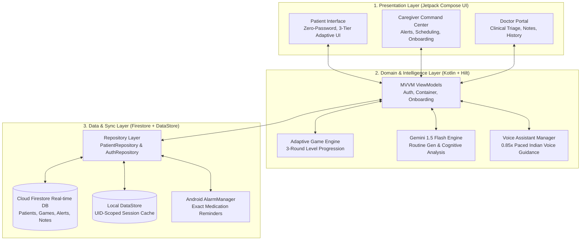

# Smart India Hackathon (SIH) — Technical Approach Document
## Project: SmritiSaathi (স্মৃতিসাথী) — Dementia Care Companion for North East India (NER)
**Slide Category:** Slide 3 — TECHNICAL APPROACH (SIH Idea Submission Template)

---

## 1. Technologies to be Used

### A. Frontend & User Interface (Client Tier)
- **Primary Mobile Platform:** Native Android Application (Kotlin 1.9.0, SDK 34 / Android 14, Min SDK 24 / Android 7.0)
- **UI Framework:** Jetpack Compose (BOM 2023.10.01) with Material 3 Design
- **Architecture Pattern:** Clean Architecture + MVVM (Model-View-ViewModel) + Unidirectional Data Flow (UDF)
- **Dependency Injection:** Dagger Hilt 2.48
- **State Management & Async:** Kotlin Coroutines & Reactive `StateFlow` / `SharedFlow`
- **Audio & Media:** Android Jetpack Media3 ExoPlayer 1.2.0 (for calm therapeutic sounds & reminiscence audio)
- **Image Processing & Rendering:** Coil Compose 2.5.0 with memory-cached asset decoding
- **Cross-Platform Companion Extensions:**
  - *iOS Secondary Companion:* SwiftUI & Combine
  - *Wear OS Watch Companion:* Compose for Wear OS (for vitals & emergency distress detection)

### B. Artificial Intelligence & Cognitive Engine
- **Large Language Model (LLM):** Google Gemini 1.5 Flash (`com.google.ai.client.generativeai:generativeai:0.9.0`)
  - *Routine Generator:* Dynamic, patient-tailored daily schedules based on stage, age, and regional culture.
  - *Cognitive Assessment Analyzer:* Automated multi-domain scoring (Memory, Attention, Problem Solving, Reaction Speed) based on live gameplay metrics and error pattern telemetry.
- **Speech Synthesis (TTS):** Android On-Device `TextToSpeech` Engine
  - Regional Indian English (`en-IN`), Hindi (`hi-IN`), Assamese (`as-IN`), and Bengali (`bn-IN`) phonetic mapping.
  - Speed calibrated to 0.85x for optimal elderly auditory processing.
- **Adaptive Difficulty Controller:** Custom heuristic state-machine algorithm that automatically steps up or gently simplifies cognitive game difficulty without triggering failure guilt.

### C. Backend, Data Sync & Persistence (100% Free-Tier Architecture)
- **Authentication:** Firebase Authentication (Google OAuth 2.0 Sign-In + Zero-Password Anonymous Token Exchange for Patients)
- **Real-Time Cloud Database:** Google Cloud Firestore (Multi-region active snapshot synchronization via Coroutine flows)
- **Local Persistence & Caching:** Android Jetpack DataStore Preferences (UID-scoped session isolation for shared family tablets)
- **Background Scheduling & Alarms:** Android `AlarmManager` with `ExactAlarms` + `BroadcastReceiver` for failsafe medication delivery even when offline or killed.

---

## 2. Methodology and Implementation Process

---

## 3. Step-by-Step Implementation Workflow

### Step 1: User Onboarding & Secure Entity Hierarchy
1. **Family / Caregiver Sign-Up:** Uses Google Sign-In (`AuthRepository.signInWithGoogle`).
2. **8-Step Comprehensive Patient Creation:**
   - Basic details, 3-tier dementia stage classification, custom daily routines, emergency contacts, medical records, and doctor assignment.
3. **Zero-Password Patient Device Pairing:**
   - Caregiver device generates a 6-digit numeric pairing code (e.g. `582910`).
   - Patient tablet enters code $\rightarrow$ triggers Firebase Anonymous Authentication $\rightarrow$ binds device hardware UID in Firestore $\rightarrow$ caches UID locally in DataStore.
   - Future app launches boot straight into `PatientTodayScreen` in under 1 second.

### Step 2: Adaptive Multi-Tier Patient Experience
- **Tier 1 (Mild Stage):** Full 4-tab interface (Today, Brain Games, Daily Schedule, Photo Memories).
- **Tier 2 (Moderate Stage):** Simplified 3-action hub with automatic audio prompts.
- **Tier 3 (Severe Stage):** Ultra-simplified single high-contrast card, 80dp+ touch targets, ambient calm music, and one-touch emergency distress call.

### Step 3: 9 Culturally Tailored Cognitive Games
- Games are organized in an adaptive 3-round, 5-level format using familiar North East Indian cultural assets:
  1. *Card Matching:* Assamese tea garden artifacts, fruits, and flowers.
  2. *Daily Routine Ordering:* Morning chai, bathing, lunch, evening walk, and night medicine.
  3. *Face Recognition:* Photos and names of actual family members.
  4. *NER Familiar Images:* Kaziranga rhino, Bihu dhol, Kamakhya temple, Mizo Puan.
  5. *Shopping Basket:* Local market vegetable and grocery list memory.
  6. *Quick Recall:* Short-term visual & auditory flash recall.
  7. *Life Stage Memory:* Reminiscence linking family history across milestones.
  8. *Guess Who's Speaking:* Family voice audio clip recognition.
  9. *Music Memory:* Regional folk tunes and rhythmic pattern recognition.

### Step 4: Real-Time AI Telemetry & Cognitive Assessment
- As the patient plays, telemetry (time-to-respond, mistake count, category hesitations) is tracked.
- `GamePerformanceAnalyzer` feeds longitudinal gameplay history to **Gemini 1.5 Flash**.
- Gemini synthesizes the data into structured clinical insights:
  - **Memory Score** (0–100)
  - **Attention Score** (0–100)
  - **Executive Function & Problem Solving** (0–100)
  - **Reaction Speed Score** (0–100)
  - **Cognitive Trend** (*Improving / Stable / Declining*)
  - **Actionable Caregiver & Doctor Recommendations**

### Step 5: Caregiver & Doctor Closed-Loop Collaboration
- **Real-Time Alerts:** If a patient misses medication or triggers confusion calming mode, a `BehavioralAlert` is pushed instantly to the family dashboard.
- **Play With Grandpa Mode:** Family members can trigger a remote `PLAY_INVITE` that rings the patient's tablet like an incoming video call to play interactive games together.
- **Doctor Oversight:** Healthcare workers triage patients into High Risk, Attention Needed, or Stable categories, add clinical observation notes, and assign focused cognitive game domains.

---

## 4. SIH Slide 3 Ready Summary (Bullet Points for Presentation)

### 🔹 Technologies Used
- **Mobile Frontend:** Android 14 (Kotlin, Jetpack Compose, Material 3, MVVM, Dagger Hilt)
- **AI & Cognitive Intelligence:** Google Gemini 1.5 Flash (Dynamic routines & multi-domain cognitive health telemetry)
- **Speech & Audio:** On-device Text-to-Speech (TTS) calibrated at 0.85x with 9 regional NER languages (Assamese, Bengali, Manipuri, Mizo, Khasi, Garo, Bodo, Nagamese, Hindi, English)
- **Cloud Backend & Sync:** Firebase Spark Free Tier (Authentication, Cloud Firestore Real-time Sync, Android DataStore Preferences)
- **Hardware Integration:** Android `AlarmManager` for offline exact-time medication reminders

### 🔹 Implementation Methodology
- **Zero-Password Anonymous Pairing:** 6-digit cryptographic pairing removes elderly cognitive barriers.
- **3-Tier Adaptive UI Architecture:** Automatically declutters UI complexity as dementia progresses.
- **Zero-Guilt Cognitive Gaming:** 9 NER-localized memory exercises with hint systems instead of error buzzers.
- **Closed-Loop Tri-Party Ecosystem:** Real-time synchronization connecting Patient, Family Caregiver, and Doctor.
- **100% Free-Tier Cost Sustainability:** Zero server operational cost, running all intelligence client-side and on free cloud quotas.
